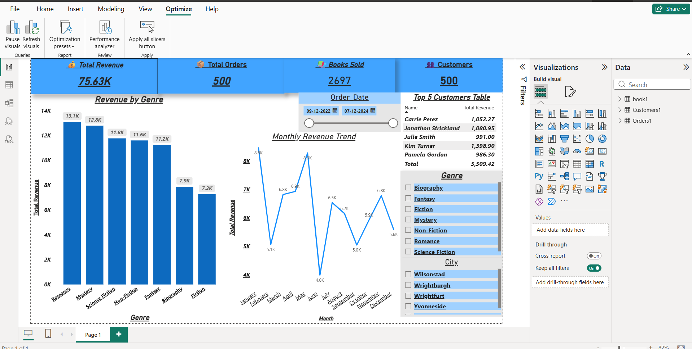

# 📊 Data Analyst Portfolio – Jai Kaushik

---

## 🔷 Power BI Project

### 📊 Sales Dashboard

**Overview:**  
Developed an interactive Power BI dashboard to analyze sales performance, customer insights, and revenue trends.

**Tools:** Power BI, Data Visualization  

---

## 🔷 MySQL Project

### 📚 Online Bookstore Sales & Customer Analytics

**Overview:**  
Analyzed bookstore database using SQL to identify sales trends, customer behavior, and inventory insights.

**Skills Used:**  
- Joins  
- Aggregations  
- Subqueries  

---

## 🔷 Python Projects

### 🎧 Spotify Data Analysis
Analyzed music data to identify trends in audio features and popularity.

### 🚗 EV Registration Analysis
Studied electric vehicle adoption trends across states.

### 🎬 Netflix Data Analysis
Explored content distribution and growth trends.

### 🍽️ Zomato Analysis
Analyzed restaurant data for ratings and cuisines.

### 💰 Loan Approval Analysis
Identified factors influencing loan approval.

### 🛒 BigBasket Analysis
Analyzed product pricing, discounts, and ratings.

---

## 📌 About Me
Aspiring Data Analyst skilled in Python, SQL, Power BI, and Excel. Passionate about turning data into actionable insights.
